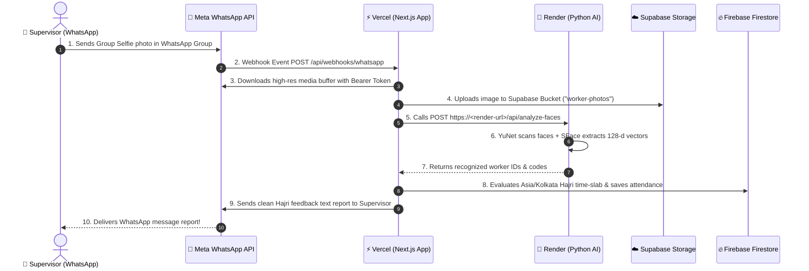

# Contractor AI - Complete Cloud Architecture & Deployment Handbook 📘

This comprehensive documentation details the platforms, system roles, data flow coordination, first-time scratch deployment steps, and continuous auto-sync redeployment workflows for **Contractor AI**.

---

## 🏗️ 1. Platform Infrastructure & Role Division

Contractor AI uses a decoupled cloud architecture designed for 100% uptime, zero operational costs, and real-time processing.

| Platform | Architectural Role | Responsibility & Work | Key Configuration |
|---|---|---|---|
| **GitHub** | **Version Control & CI/CD Trigger** | Stores project source code (`frontend/` & `face-service/`). Triggers automatic build deployments whenever code is pushed to the `main` branch. | Repository: `tradingash8418-commits/ai_attendance` |
| **Vercel** | **Frontend & API Gateway** | Hosts the Next.js 14 web dashboard and handles Meta WhatsApp HTTP Webhook endpoints (`/api/webhooks/whatsapp`). Automatically builds Next.js serverless functions. | Root Directory: `frontend/`<br>Domain: `https://ai-attendance-flax.vercel.app` |
| **Render.com** | **Python AI Microservice** | Hosts the FastAPI Python 3 engine running OpenCV YuNet (Face Detection) and SFace (128-d Neural Face Feature Embeddings). Processes group selfies 24/7/365. | Root Directory: `face-service/`<br>Build: `pip install -r requirements.txt`<br>Start: `uvicorn main:app --host 0.0.0.0 --port $PORT` |
| **Firebase Cloud Firestore** | **NoSQL Real-Time Database** | Stores multi-tenant construction sites, worker profiles, supervisor phone mappings, and single-record daily attendance documents (`workerId_siteId_workDate`). | Collections: `workers`, `sites`, `supervisors`, `attendance_sessions`, `attendance_records` |
| **Supabase Storage** | **Cloud Image Storage & CDN** | Stores worker reference face photos and received WhatsApp attendance proof photos. Serves image URLs over HTTPS CDN. | Bucket: `worker-photos` (`IMAGE_STORAGE_MODE=supabase`) |
| **Meta WhatsApp Cloud API** | **Messaging Interface** | Receives group selfies sent by supervisors on WhatsApp and dispatches automated Hajri text feedback reports to the supervisor's phone. | Webhook Callback: `https://ai-attendance-flax.vercel.app/api/webhooks/whatsapp` |

---

## 🔄 2. End-to-End System Coordination Flow



---

## 🚀 3. Deploying Everything from Scratch (First-Time Setup)

### Step 3.1: Push Local Code to GitHub
```powershell
cd "d:\face recognition attendence"
git init
git add .
git commit -m "Initial commit of Contractor AI"
git branch -M main
git remote add origin https://github.com/<YOUR-USERNAME>/<YOUR-REPO-NAME>.git
git push -u origin main
```

---

### Step 3.2: Deploy Next.js Frontend on Vercel
1. Log in to [Vercel.com](https://vercel.com) using your GitHub account.
2. Click **`[Add New...]`** $\rightarrow$ **`[Project]`**.
3. Select your GitHub repository (`ai_attendance`) and click **`[Import]`**.
4. Set **Root Directory** to `frontend`.
5. Under **Environment Variables**, add the following keys from `frontend/.env.local`:
   * `WHATSAPP_ACCESS_TOKEN` = `EAAG...`
   * `WHATSAPP_PHONE_NUMBER_ID` = `1330066433517275`
   * `WHATSAPP_BUSINESS_ACCOUNT_ID` = `1738385663951266`
   * `WHATSAPP_VERIFY_TOKEN` = `contractor_ai_whatsapp_verify_token_123`
   * `WHATSAPP_APP_SECRET` = `<YOUR_META_APP_SECRET>`
   * `FACE_SERVICE_URL` = `https://<YOUR-RENDER-APP>.onrender.com` (From Step 3.3)
   * `IMAGE_STORAGE_MODE` = `supabase`
   * `NEXT_PUBLIC_SUPABASE_URL` = `https://ylrmdteluxqryifdailv.supabase.co`
   * `SUPABASE_SERVICE_ROLE_KEY` = `<YOUR_SUPABASE_KEY>`
6. Click **`[Deploy]`**. Vercel will output a live domain (e.g., `https://ai-attendance-flax.vercel.app`).

---

### Step 3.3: Deploy Python AI Microservice on Render.com
1. Log in to [Render.com](https://render.com) using your GitHub account.
2. Click **`[New +]`** $\rightarrow$ **`[Web Service]`**.
3. Select your repository (`ai_attendance`).
4. Configure service settings:
   * **Name**: `ai-attendance-face-service`
   * **Root Directory**: `face-service`
   * **Environment**: `Python 3`
   * **Build Command**: `pip install -r requirements.txt`
   * **Start Command**: `uvicorn main:app --host 0.0.0.0 --port $PORT`
5. Click **`[Create Web Service]`**. Render will provision a 24/7 HTTPS URL (e.g., `https://ai-attendance-face-service.onrender.com`).

---

### Step 3.4: Configure Meta WhatsApp Webhook Callback
1. Open [Meta Developer Dashboard](https://developers.facebook.com/apps/1820168339341443) $\rightarrow$ **WhatsApp $\rightarrow$ Configuration**.
2. Set **Callback URL**: `https://ai-attendance-flax.vercel.app/api/webhooks/whatsapp`
3. Set **Verify Token**: `contractor_ai_whatsapp_verify_token_123`
4. Click **`[Verify and save]`**.
5. Click **`[Subscribe]`** next to `messages` under Webhook fields.

---

## 🔁 4. How Redeployment Works When Code Changes (Auto-Sync)

When you make changes to your codebase locally (e.g., updating UI designs, adding Hajri rules, or modifying AI algorithms):

### Automatic GitHub CI/CD Sync (Zero Effort)
1. Edit code in VS Code.
2. Run Git commands in PowerShell:
   ```powershell
   git add .
   git commit -m "Updated Hajri rules and UI design"
   git push origin main
   ```
3. **What happens automatically**:
   * **Vercel**: Automatically detects `git push`, builds the Next.js app in 15 seconds, and updates `https://ai-attendance-flax.vercel.app` with zero downtime.
   * **Render**: Automatically detects `git push`, rebuilds the Python container, and reloads `https://ai-attendance-face-service.onrender.com`.

---

## 🛠 5. Updating Environment Variables Later

If you need to change your Meta WhatsApp Token, Firebase Key, or Supabase credentials in the future:

1. **Vercel**: Go to Vercel Dashboard $\rightarrow$ **Project Settings** $\rightarrow$ **Environment Variables** $\rightarrow$ Edit key $\rightarrow$ Click **Save**. Then click **`[Deployments]`** $\rightarrow$ **`[Redeploy]`**.
2. **Render**: Go to Render Dashboard $\rightarrow$ **Environment** tab $\rightarrow$ Edit key $\rightarrow$ Click **Save Changes**. Render will automatically restart the service.

---

*Document Version: 1.0.0 | Contractor AI Production Architecture Handbook*
