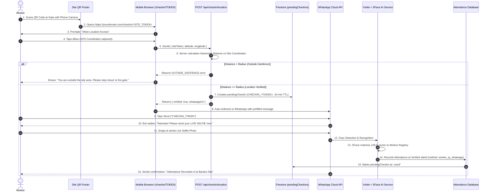

# Contractor AI — Site QR + GPS + WhatsApp Attendance System (Complete Guide) 📍📱

Complete end-to-end operational manual, system architecture, step-by-step administrator guide, worker user tutorial, technical specifications, and troubleshooting documentation for the **Dual-Path Attendance System**.

---

## 📑 Table of Contents
1. [Executive Summary & Dual Architecture](#-1-executive-summary--dual-architecture)
2. [Complete Flow Diagrams](#-2-complete-flow-diagrams)
3. [Contractor Admin Setup Tutorial](#-3-contractor-admin-setup-tutorial)
4. [Worker Step-by-Step Guide (How to Use)](#-4-worker-step-by-step-guide-how-to-use)
5. [Supervisor Workflow (Backward Compatibility)](#-5-supervisor-workflow-backward-compatibility)
6. [Technical Engine & Security Architecture](#-6-technical-engine--security-architecture)
7. [Hajri Calculation & Shift Slabs Table](#-7-hajri-calculation--shift-slabs-table)
8. [Multi-Site Worker Roaming Handling](#-8-multi-site-worker-roaming-handling)
9. [Edge Cases & Error Handling Guide](#-9-edge-cases--error-handling-guide)
10. [Printable Notice Board Template (Hindi & English)](#-10-printable-notice-board-template-hindi--english)

---

## 🌟 1. Executive Summary & Dual Architecture

Contractor AI operates two non-conflicting attendance methods on a single unified database:

```text
┌─────────────────────────────────────────────────────────────────────────────┐
│                            CONTRACTOR AI ENGINE                             │
├──────────────────────────────────────┬──────────────────────────────────────┤
│ METHOD 1: SUPERVISOR WORKFLOW        │ METHOD 2: WORKER SELF CHECK-IN       │
│ (Group Photo / Supervisor Phone)     │ (Site QR + GPS + WhatsApp Selfie)    │
├──────────────────────────────────────┼──────────────────────────────────────┤
│ • Supervisor sends group selfie      │ • Worker scans printed QR at gate    │
│ • No QR or GPS required              │ • Browser verifies GPS geofence      │
│ • Identified via Supervisor Phone    │ • Opens WhatsApp with secure token   │
│ • SFace AI matches all workers       │ • Worker sends live selfie           │
│ • Method: 'supervisor_whatsapp'      │ • Method: 'worker_qr_whatsapp'       │
└──────────────────────────────────────┴──────────────────────────────────────┘
```

---

## 🔄 2. Complete Flow Diagrams

### A. Worker Self Check-In Sequence Diagram



---

## 🛠 3. Contractor Admin Setup Tutorial

### Step 1: Open Construction Sites
1. Open the Contractor Dashboard.
2. Click on **Sites** in the top navigation bar (`/sites`).
3. You will see cards for all your construction projects (e.g., *Site B - Bandra Residential*).

### Step 2: Set Site Geofence Location
1. On the site card, check the **Geofence Badge**:
   * If it shows `📍 Location Not Set`, click **Set Location**.
2. **Option A (Recommended): 1-Click Live GPS Capture**
   * If you or your supervisor are physically standing at the site entrance:
   * Click **`Use My Current GPS Location (1-Click)`**.
   * Your browser will fetch the exact high-accuracy Latitude and Longitude.
3. **Option B: Manual Latitude & Longitude**
   * Enter coordinates manually (e.g., `Latitude: 19.059600`, `Longitude: 72.829500`).
4. **Set Allowed Geofence Radius**:
   * Standard Site Gate: **150 meters** (Default).
   * Large Commercial Complex / Multi-acre Site: **250 to 500 meters**.
5. Click **Save Geofence**.

### Step 3: Print Site QR Code Poster
1. On the site card, click **View QR**.
2. A high-resolution **Site Entrance Attendance Poster** will open.
3. Click **Print Poster (A4)**.
4. **Best Practice:** Print in color or black/white, laminate the poster, and paste it at:
   * Main Worker Entry Gate
   * Security Guard Cabin
   * Tool Shed / Biometric Area

---

## 📱 4. Worker Step-by-Step Guide (How to Use)

### Zero App Download • Works on Any Smartphone

```text
╔══════════════════════════════════════════════════════════════════════════════╗
║                       WORKER 4-STEP ATTENDANCE FLOW                         ║
╠══════════════════════════════════════════════════════════════════════════════╣
║ 1. SCAN QR          Open Phone Camera / WhatsApp / Google Lens              ║
║                     Scan the printed QR Code at the gate.                    ║
║                                                                              ║
║ 2. ALLOW GPS        A simple webpage opens.                                  ║
║                     Tap "Allow Location" when your phone asks.              ║
║                                                                              ║
║ 3. OPEN WHATSAPP    Webpage verifies you are at the site.                    ║
║                     WhatsApp opens automatically with a prefilled message.   ║
║                     Tap Send.                                                ║
║                                                                              ║
║ 4. SEND SELFIE      Click a clean front-facing selfie and send it.           ║
║                     AI confirms: "Attendance Recorded ✅"                    ║
╚══════════════════════════════════════════════════════════════════════════════╝
```

---

## 👥 5. Supervisor Workflow (Backward Compatibility)

The existing supervisor workflow remains **100% active with zero requirements for QR or GPS**:

1. **Supervisor opens WhatsApp** on their registered mobile number.
2. **Takes a group selfie / single worker photo** of the workforce.
3. **Sends photo to WhatsApp Bot**.
4. **System recognizes faces**, maps attendance to the supervisor's assigned site, and sends back a complete shift summary report.

---

## 🔒 6. Technical Engine & Security Architecture

### 1. Pure Haversine Geofence Engine (100% Free)
Distance between the worker's mobile GPS $(lat_1, lon_1)$ and the site center $(lat_2, lon_2)$ is computed using the Great-Circle Haversine Formula:

$$\Delta\phi = \frac{(lat_2 - lat_1) \cdot \pi}{180}, \quad \Delta\lambda = \frac{(lon_2 - lon_1) \cdot \pi}{180}$$
$$a = \sin^2\left(\frac{\Delta\phi}{2}\right) + \cos(\phi_1) \cdot \cos(\phi_2) \cdot \sin^2\left(\frac{\Delta\lambda}{2}\right)$$
$$d = 2 \cdot R \cdot \text{atan2}\left(\sqrt{a}, \sqrt{1 - a}\right) \quad (\text{where } R = 6,371,000 \text{ meters})$$

* Decision: If $d \le \text{radiusMeters}$, verification succeeds.
* **Security Rule:** Verification runs exclusively on the server (`POST /api/checkin/location`). The client cannot fake authorization.

### 2. QR Token Security
* The QR code encodes **only the URL**: `https://<YOUR_DOMAIN>/checkin/<SITE_TOKEN>`.
* It does **NOT** store coordinates, worker IDs, or attendance data in the QR.
* The backend generates a random, short-lived token `CHECKIN_CK_XXXX_YYYY` with a **10-minute Time-To-Live (TTL)**.
* Once attendance is marked, the token status becomes `used`.

### 3. SFace + YuNet Deep Learning AI
* **Detector:** YuNet ONNX Neural Network (detects rotated, tilted, and scaled human faces).
* **Recognizer:** SFace ONNX Neural Network (computes 128-D normalized face vector).
* **Matching:** Cosine Distance $\le 0.75$ matches registered worker embedding.

---

## ⏰ 7. Hajri Calculation & Shift Slabs Table

All shifts follow the authoritative **`Asia/Kolkata` (IST UTC+05:30)** time slabs:

| Slab ID | Shift Type | Hajri Value | Start Time (IST) | End Time (IST) | Note |
|---|---|---|---|---|---|
| `rule_normal` | **Normal** | **1.0** | `10:00:00 AM` | `07:29:59 PM` | Standard full workday |
| `rule_dedhi` | **Dedhi** | **1.5** | `07:30:00 PM` | `09:29:59 PM` | Overtime 1.5 shift |
| `rule_double` | **Double** | **2.0** | `09:30:00 PM` | `12:59:59 AM` | Night overtime 2.0 shift |
| `rule_dhai` | **Dhai** | **2.5** | `01:00:00 AM` | `02:29:59 AM` | Late night (+1 Next Day) |
| `rule_three` | **Three** | **3.0** | `02:30:00 AM` | `03:30:59 AM` | Overnight shift (+1 Next Day) |

---

## 🚜 8. Multi-Site Worker Roaming Handling

In construction projects, workers frequently move between different sites on different days. This is handled **automatically**:

1. **Global Worker Registry:** Worker facial embeddings are registered once globally, not locked to one site.
2. **Site Determination:**
   * If Worker *Abhay* scans the **Bandra Site QR** on Monday $\rightarrow$ attendance records under `siteId = Bandra`.
   * If *Abhay* moves to **Andheri Site** on Tuesday and scans the **Andheri QR** $\rightarrow$ attendance records under `siteId = Andheri`.
3. **Contractor Benefit:** Zero manual transfer paperwork or site reassignment required.

---

## ❓ 9. Edge Cases & Error Handling Guide

| Error Message in Browser / WhatsApp | Root Cause | Solution |
|---|---|---|
| **"Location permission is required for site check-in"** | Worker tapped "Block" on browser location popup | Open Chrome/Safari Settings $\rightarrow$ Site Settings $\rightarrow$ Location $\rightarrow$ Set to Allow $\rightarrow$ Tap Try Again. |
| **"You're outside the allowed site area"** | Worker is standing further than the configured radius (e.g., 210m away from gate) | Ask worker to step closer to the gate. Admin can also increase site radius on `/sites` page if the site is very large. |
| **"Site location is not configured"** | Admin has not set coordinates on `/sites` page | Admin must open `/sites` and click **Set Location**. |
| **"Your site check-in has expired"** | Worker scanned QR but waited >10 minutes before sending selfie | Worker should scan the QR poster again and send selfie immediately. |
| **"Face Not Recognized"** | Selfie was too dark, blurry, or covered with mask/sunglasses | Worker should click a clear, front-facing selfie in good light. |

---

## 📄 10. Printable Notice Board Template (Hindi & English)

Copy and print this section to stick on your construction site notice board:

```text
================================================================================
                    🏗️ CONTRACTOR AI — SITE ATTENDANCE
================================================================================

📱 WORKER ATTENDANCE KAISE LAGAYEIN (HINDI):
1️⃣ Gate par lage QR Code ko apne mobile camera ya WhatsApp se SCAN karein.
2️⃣ Mobile browser me "Allow Location" (स्थान की अनुमति) par tap karein.
3️⃣ WhatsApp automatically open hoga ➡ Apni saaf LIVE SELFIE photo bhejein!
4️⃣ "Attendance Recorded ✅" ka message aane par aapki hajri lag jayegi.

📱 HOW TO MARK ATTENDANCE (ENGLISH):
1️⃣ Scan the QR code at the entrance gate using your phone camera or WhatsApp.
2️⃣ Tap "Allow Location" on your mobile browser.
3️⃣ WhatsApp will open automatically ➡ Snap and send your live front selfie!
4️⃣ Attendance is marked as soon as you receive the confirmation message.

⚠️ Important: QR code sirf site ke daayre (150 meters) ke andar hi kaam karega.
================================================================================
```
